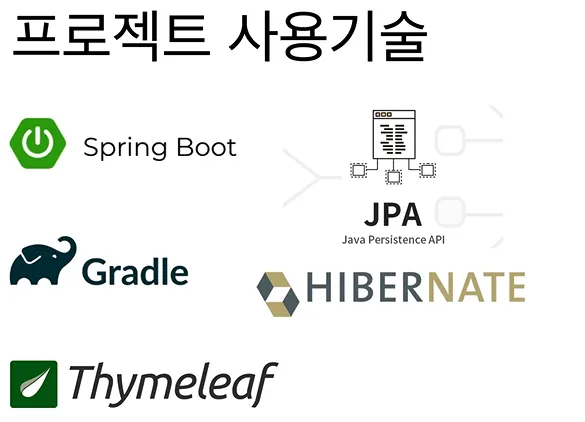
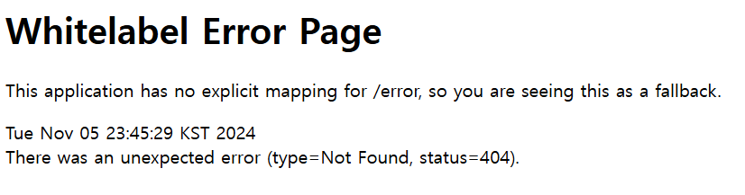
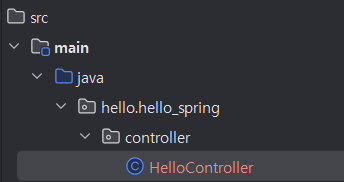
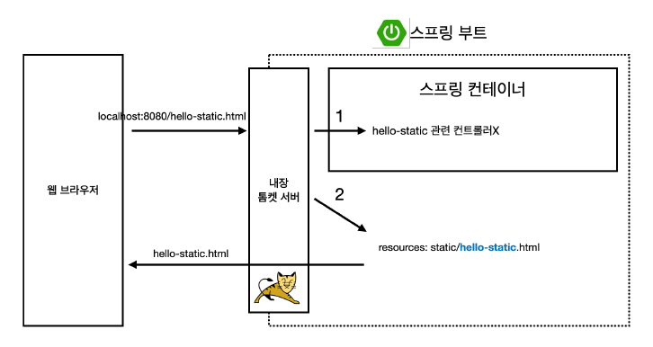
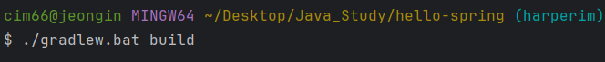

# 01. 강의 소개 & 프로젝트 환경설정

## 1. 강의 소개
- 스프링 학습 이유
    - 실무에서 제대로 동작하는 웹 어플리케이션을 만들기 위해

> 환경 설정
> 
- Java 17 설치
- IDE : InteliJ 또는 Eclipse 설치
    - InteliJ 추천!

- 간단한 웹 애플케이션 개발
    - 스프링 프로젝트 생성
    - 스프링 부트로 웹 서버 실행
    - 회원 도메인 개발
    - **웹 MVC 개발**
    - **DB 연동 - JDBC, JPA, 스프링 데이터 JPA**
    - 테스트 케이스 작성
    


- 수업 진행 방식
    - 스프링 기술 그 자체에 매몰 X
    - 어떻게 사용해야 하는지에 초점
    - 오래된 스프링 기술 X
    - 마이너한 스프링 기술 X
    
    **(+) 처음부터 끝까지 직접 코딩** 
    

## 2. 프로젝트 생성

> 프로젝트 생성 과정
> 
1. 스프링 부트 스타터 사이트로 이동해서 스프링 프로젝트 생성
    
    [start.spring.io](https://start.spring.io/)
    
2. 프로젝트 선택
    - Project : Gradle - Groovy Project
    - Spring Boot : 3.xx
    - Language : Java
    - Packaging : Jar
    - Java : 17 or 21
    - Project Metadata
        - groupId : hello
        - artifactId : hello-spring
    - Dependencies : Spring Web, Thymeleaf

> 파일 설명
> 
- `src > test`
    - test가 요즘 개발 트렌드에서 중요하다는 것을 알 수 있음
- `src > main > resources`
    - 실제 자바 코드 파일을 제외한 xml 이나 설정 파일 등을 담고 있음 
    (자바 파일을 제외한 나머지는 다 resources 로 생각하기)
- `build.gradle`
    - gradle : 버전 설정, 라이브러리 가져오는 역할

```java
plugins {
	id 'java'
	id 'org.springframework.boot' version '3.3.5'
	id 'io.spring.dependency-management' version '1.1.6'
}

group = 'hello'
version = '0.0.1-SNAPSHOT'

java {
	toolchain {
		languageVersion = JavaLanguageVersion.of(17)
	}
}

repositories {
	mavenCentral()
}

// 아래의 라이브러리들은 mavenCentral이라는 공개된 사이트에서 다운로드 받기
dependencies {
	implementation 'org.springframework.boot:spring-boot-starter-thymeleaf'
	implementation 'org.springframework.boot:spring-boot-starter-web'
	testImplementation 'org.springframework.boot:spring-boot-starter-test'
	testRuntimeOnly 'org.junit.platform:junit-platform-launcher'
}

tasks.named('test') {
	useJUnitPlatform()
}
```

- `src > main > java > hello.hellospring > HelloSpringApplication.java`
    - public static 라인 실행
    - [`localhost:8080`](http://localhost:8080) 접속
    - 아래와 같은 에러 창이 뜬다면 성공!



- Settings > Build, Execution, Deployment > Build Tools > Gradle
    - Build and run using : Gradle
    - Run tests using : Gradle
    - 이렇게 설정해주면 gradle을 통하지 않고 바로 자바를 띄워주기 때문에 훨씬 빠르게 실행 가능

## 3. 라이브러리 살펴보기

- External Libraries 에서 보면 가져올 라이브러리의 종류가 굉장히 많은 것 확인 가능
- 한 그래들이 필요해서 가져온다면, 해당 그래들을 구성하는데 필요한 그래들, 그 그래들 구성에 필요한 그래들, ….., 굉장히 많은 그래들을 가져오게 됨
- 계속해서 파고 들어간다고 생각하기

> 스프링 부트 라이브러리
> 
- spring-boot-starter-web
    - spring-boot-starter-tomcat : 톰캣
    - srping-webmvc : 스프링 웹 MVC
- spring-boot-starter-thymlear : 타임리프 템플릿 엔진
- spring-boot-starter : 스프링 부트 + 스프링 코어 + 로깅
    - spring-boot
        - spring-core
    - spring0boot-starter-logging
        - logback, slf4j

> 컴파일 라이브러리
> 
- spring-boot-starter-logging 가져올 시, 함께 따라오는 라이브러리
    - logback
        - 실제 로그를 어떤 구현체로 출력할 것인지를 따져 보았을 때, logback 선택
        - 성능도 빠르고, 여러 가지 지원하는 경우 多
    - slf4j
        - 인터페이스

> 테스트 라이브러리
> 
- JUnit (핵심)
    - 4가 오래 유지되다가 최근 5로 넘어가는 추세
- Modito : 테스트 편리하게 도와주는 역할
- AssertJ : 테스트 편리하게 도와주는 역할
- Spring-test : spring과 통합해서 테스트할 수 있도록 도와주는 라이브러리

## 4. View 환경 설정

> Welcome Page 만들기 (홈화면 만들기)
> 
- `src/main/resources/static/index.html`
    
    ```html
    <!-- index.html -->
    
    <!DOCTYPE HTML>
    <html>
    <head>
        <title>Hello</title>
        <meta http-equiv="Content-Type" content="text/html; charset=UTF-8" />
    </head>
    <body>
    Hello
    <a href="/hello">hello</a>
    </body>
    </html>
    ```
    

> 필요한 내용 찾는 Tip
> 
1. https://spring.io/ 들어가기
2. Projects > Spring Boot > Learn > 해당 버전의 `Reference Doc.` 선택 
3. 원하는 내용 검색 

> 템플릿 엔진
> 
- 원하는 대로 루프를 넣는 등 모양을 바꿀 수 있는 기능
- Thymeleaf 라는 템플릿 엔진 사용할 예정

[Thymeleaf](https://www.thymeleaf.org/)

- 아래의 경로에 `HelloController` 클래스 생성



```java
package hello.hello_spring.controller;

import org.springframework.stereotype.Controller;
import org.springframework.web.bind.annotation.GetMapping;

@Controller
public class HelloController {
    @GetMapping("hello")
    public String hello(Model model) {
        model.addAttribute("data", "hello!");
        return "hello";
    }
}
```

```html
<!-- src/resources/templates/hello.html  -->

<!DOCTYPE HTML>
<html xmlns:th="http://www.thymeleaf.org">
<head>
    <title>Hello</title>
    <meta http-equiv="Content-Type" content="text/html; charset=UTF-8" />
</head>
<body>
<p th:text="안녕하세요. " + ${data}>안녕하세요. 손님</p>
</body>
</html>
```

> 스프링 부트 동작 흐름
> 



- 컨트롤러에서 리턴 값으로 문자를 반환하면 뷰 리졸버(`viewResolver`)가 화면을 찾아서 처리한다.
    - 스프링부트 템플릿 엔진 기본 viewName 매핑
    - `resources:templates/` + (ViewName) + `.html`

**※ 코드 변경 후, 실행 껐다가 다시 켜기** 

## 5. 빌드하고 실행하기

- 필요한 라이브러리 다운로드
    - macOS : `./gradle.bat build`



- `$cd build` : build 라는 폴더가 생성됨
    - `$cd libs`
    - `$ ls -arlth` : 21Mb 파일이 생성된 것을 확인할 수 있다.

- java 실행시키기
    
    ```bash
    $ java -jar hello-spring-0.0.1-SNAPSHOT.jar
    ```
    
    - 잘 안되는 경우
        - hello-spring 위치로 되돌아오기
        - `$ ./gradlew clean`  : build 폴더 사라짐
            - `$ ls -arlth` 로 삭제 확인
        - `$ ./gradlew clean build` : 지우고 다시 설치

### 참고
- 스프링 입문 - 코드로 배우는 스프링 부트, 웹 MVC, DB 접근 기술 [인프런]  
[[지금 무료]스프링 입문 - 코드로 배우는 스프링 부트, 웹 MVC, DB 접근 기술 강의 | 김영한 - 인프런](https://www.inflearn.com/course/%EC%8A%A4%ED%94%84%EB%A7%81-%EC%9E%85%EB%AC%B8-%EC%8A%A4%ED%94%84%EB%A7%81%EB%B6%80%ED%8A%B8?attributionToken=iQHwiAoMCLbjqLkGELj_2ZADEAEaJDY3MzRjZWY3LTAwMDAtMjU3Yi04NDE3LTNjMjg2ZDM0NjZiZSoHMTQ5Nzg0MzIwo4CXIra3jC2o5aotjpHJMMLwnhXFy_MXjr6dFdSynRWb1rctkPeyMJruxjCY1rctOg5kZWZhdWx0X3NlYXJjaEgBaAF6AnNp)