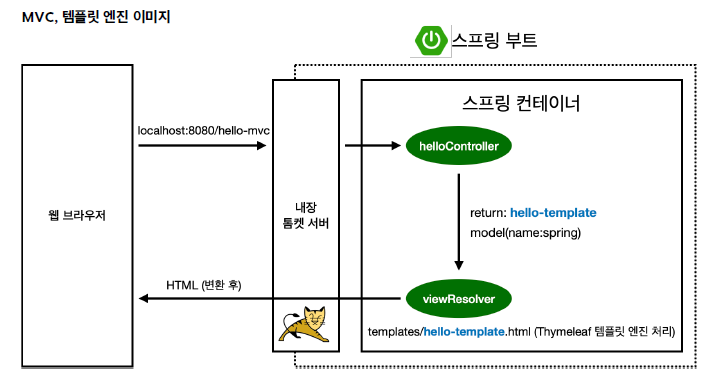

# 섹션 2. 스프링 웹 개발 기초

## 1. 정적 컨텐츠

- 파일을 웹 브라우저에 그대로 내려주는 것
- 정적 컨텐츠 vs MVC vs API
    
    
    | **정적 컨텐츠** | **MVC**  | **API** |
    | --- | --- | --- |
    | 파일을 웹 브라우저에 그대로 내려주는 것 | HTML을 그냥 주는 것이 아니라 서버에서 프로그래밍 한 후, HTML을 동적으로 바꿔서 보여주는 것  | JSON 구조 포맷으로 클라이언트에게 데이터를 전달하는 것 |
- 스프링 부트는 정적 컨텐츠 기능 자동으로 지원

[Spring Boot Features](https://docs.spring.io/spring-boot/docs/2.3.1.RELEASE/reference/html/spring-boot-features.html#boot-features-spring-mvc-static-content)

```html
<!-- src/resources/static/hello-satic.html -->

<!DOCTYPE HTML>
<html>
<head>
    <title>static content</title>
    <meta http-equiv="Content-Type" content="text/html; charset=UTF-8" />
</head>
<body>
정적 컨텐츠 입니다.
</body>
</html>
```

- [`http://localhost:8080/hello-static.html`](http://localhost:8080/hello-static.html) 경로로 들어오기


1. [`localhost:8080/hello-static.html`](http://localhost:8080/hello-static.html) 파일 경로 요청
2. hello-static 관련 컨트롤러 확인 ⇒ 없음 확인 (컨트롤러가 우선 순위를 가짐)
3. resources/static 안에 있는 hello-static.html 파일 찾음
4. 있다면 반환 

## 2. MVC & 템플릿 엔진

- MVC : Model, View, Controller
    - View : 화면을 그리는 데에만 집중
    - Model, Controller : 비즈니스 로직과 관련이 있거나 내부적인 것을 처리하는데 집중
    
    ⇒ 그래서 Model, View, Controller 3가지로 나눔 (꼭 나누어서 진행하기)
    

- JSP, PHP : 템플릿 엔진
    - HTML을 그냥 주는 것이 아니라 서버에서 프로그래밍 한 후, HTML을 동적으로 바꿔서 보여주는 것
    - 모델, 템플릿 엔진, 화면 ⇒ 모델뷰 컨트롤러 (MVC)

```java
// src/main/java/hello.hello_spring/controller/HelloController

package hello.hello_spring.controller;

import org.springframework.stereotype.Controller;
import org.springframework.ui.Model;
import org.springframework.web.bind.annotation.GetMapping;

@Controller
public class HelloController {
    @GetMapping("hello")
    public String hello(Model model) {
        model.addAttribute("data", "hello!");
        return "hello";
    }
		
		// 추가된 부분 
    @GetMapping("hello-mvc")
    public String helloMvc(@RequestParam("name") String name, Model model) {
        model.addAttribute("name", name);
        return "hello-template";
    }
}

```

```html
<!-- hello-template.html -->

<!DOCTYPE HTML>
<html xmlns:th="http://www.thymeleaf.org">
<body>
<!-- return 값이 없다면 hello! empty 반환, 있다면 'hello ' + ${name} 반환 -->
<!-- 서버 없을 때 html 확인 가능 -->
<p th:text="'hello ' + ${name}">hello! empty</p>
</body>
</html>
```

- http://localhost:8080/hello-static.html
    
    

- http://localhost:8080/hello-mvc?name=spring!!
    
    



1. 웹 브라우저에서 [`localhost:8080/hello-mvc`](http://localhost:8080/hello-mvc) 요청
2. 스프링 부트 띄울 때 같이 띄우는 내장 톰캣 서버 먼저 거침 
3. 내장 톰캣 서버가 hello-mvc 가 왔다며 스프링에게 전달
4. 스프링은 helloController 메서드에 맵핑이 되어 있는 것을 확인 후, 그 메서드 호출
5. return 이름을 `hello-template` / model은 key=name, value=spring 
6. 위의 정보를 viewResolver (화면 해결자 역할)가 동작 
    - viewResolver : 뷰를 찾아주고 템플릿을 연결시켜주는 역할
7. return의 스트링 네임과 같은 것을 찾아 Thymeleaf 템플릿 엔진에서 처리해달라고 넘김
8. 템플릿 엔진이 렌더링 해서 변환 후, 변환한 HTML을 웹 브라우저에 반환 

## 3. API

- 정적 콘텐츠가 아니라면 
HTML로 반환하냐, API 방식으로 데이터를 바로 반환하냐 2가지 고민하기!

```java
// HelloController

package hello.hello_spring.controller;

import org.springframework.stereotype.Controller;
import org.springframework.ui.Model;
import org.springframework.web.bind.annotation.GetMapping;
import org.springframework.web.bind.annotation.RequestParam;
import org.springframework.web.bind.annotation.ResponseBody;

@Controller
public class HelloController {
    @GetMapping("hello")
    public String hello(Model model) {
        model.addAttribute("data", "hello!");
        return "hello";
    }

    @GetMapping("hello-mvc")
    public String helloMvc(@RequestParam("name") String name, Model model) {
        model.addAttribute("name", name);
        return "hello-template";
    }
		
		// 추가된 부분 
    @GetMapping("hello-string")
    @ResponseBody  // body부에 return 데이터를 직접 넣어주겠다는 뜻 
    public String helloString(@RequestParam("name") String name) {
        return "hello " + name;  // "hello spring"
    }
}
```


- 이전의 템플릿 엔진은 화면을 가지고 조작하는 방식
- API 경우는 데이터를 그대로 내려줌

> 데이터 반환을 원하는 경우 (API 방식을 사용하는 주목적)
> 

```java
// HelloController

package hello.hello_spring.controller;

import org.springframework.stereotype.Controller;
import org.springframework.ui.Model;
import org.springframework.web.bind.annotation.GetMapping;
import org.springframework.web.bind.annotation.RequestParam;
import org.springframework.web.bind.annotation.ResponseBody;

@Controller
public class HelloController {
    @GetMapping("hello")
    public String hello(Model model) {
        model.addAttribute("data", "hello!");
        return "hello";
    }

    @GetMapping("hello-mvc")
    public String helloMvc(@RequestParam("name") String name, Model model) {
        model.addAttribute("name", name);
        return "hello-template";
    }

    @GetMapping("hello-string")
    @ResponseBody
    public String helloString(@RequestParam("name") String name) {
        return "hello " + name;
    }
		
		// 추가된 부
    @GetMapping("hello-api")
    @ResponseBody
    public Hello helloApi(@RequestParam("name") String name) {
        Hello hello = new Hello();
        hello.setName(name);
        return hello;
    }

    static class Hello {
        private String name;

        public String getName() {
            return name;
        }

        public void setName(String name) {
            this.name = name;
        }
    }
}

```


- 출력 결과 : JSON 방식
- `@ResponseBody` 라고 해놓으면, JSON으로 반환하는 게 디폴트
- Generate > Getter and Setter  > OK 설정 (프로퍼티 접근 방식 이라고도 함)

> **@ResponseBody 사용 원리**
> 


1. 웹 브라우저에서 [`localhost:8080/hello-api`](http://localhost:8080/hello-api) 요청
2. 톰캣 내장 서버에서 hello-api가 왔다고 스프링에 전달 
3. 스프링은 hello-api가 있는 것을 확인 후, ResponserBody 애너테이션이 붙어있는 것도 확인 
    - 안 붙어 있는 경우
        - View Resolver에게 던짐
        - 나한테 맞는 템플릿 찾아서 돌려줘!
    - **붙어 있는 경우 (현재 상황)**
        - HTTP 응답에 이 데이터 그대로 넣기
        - 문자가 아닌 **“객체”**
        - 문자인 경우, 문자 값을 HTTP 응답에 바로 넣어서 전달
        - **객체인 경우,** json 방식으로 데이터를 만들어서 HTTP 응답에 반환하겠다는 것이 디폴트
4. HttpMessageConverter 동작 
    - 단순 문자인 경우, StringConverter가 동작
    - 객체인 경우, JsonConverter가 동작
    
    ⇒ json 스타일로 변환 
    
5. 변환한 json은 나를 요청한 웹브라우저 or 서버에게 전달 

> 참고 : 클라이언트의 HTTP Accept 헤더와 서버의 컨트롤러 반환 타입 정보 둘을 조합해서 `HttpMessageConverter`가 선택된다.
>

### 참고
- 스프링 입문 - 코드로 배우는 스프링 부트, 웹 MVC, DB 접근 기술 [인프런]  
[[지금 무료]스프링 입문 - 코드로 배우는 스프링 부트, 웹 MVC, DB 접근 기술 강의 | 김영한 - 인프런](https://www.inflearn.com/course/%EC%8A%A4%ED%94%84%EB%A7%81-%EC%9E%85%EB%AC%B8-%EC%8A%A4%ED%94%84%EB%A7%81%EB%B6%80%ED%8A%B8?attributionToken=iQHwiAoMCLbjqLkGELj_2ZADEAEaJDY3MzRjZWY3LTAwMDAtMjU3Yi04NDE3LTNjMjg2ZDM0NjZiZSoHMTQ5Nzg0MzIwo4CXIra3jC2o5aotjpHJMMLwnhXFy_MXjr6dFdSynRWb1rctkPeyMJruxjCY1rctOg5kZWZhdWx0X3NlYXJjaEgBaAF6AnNp)